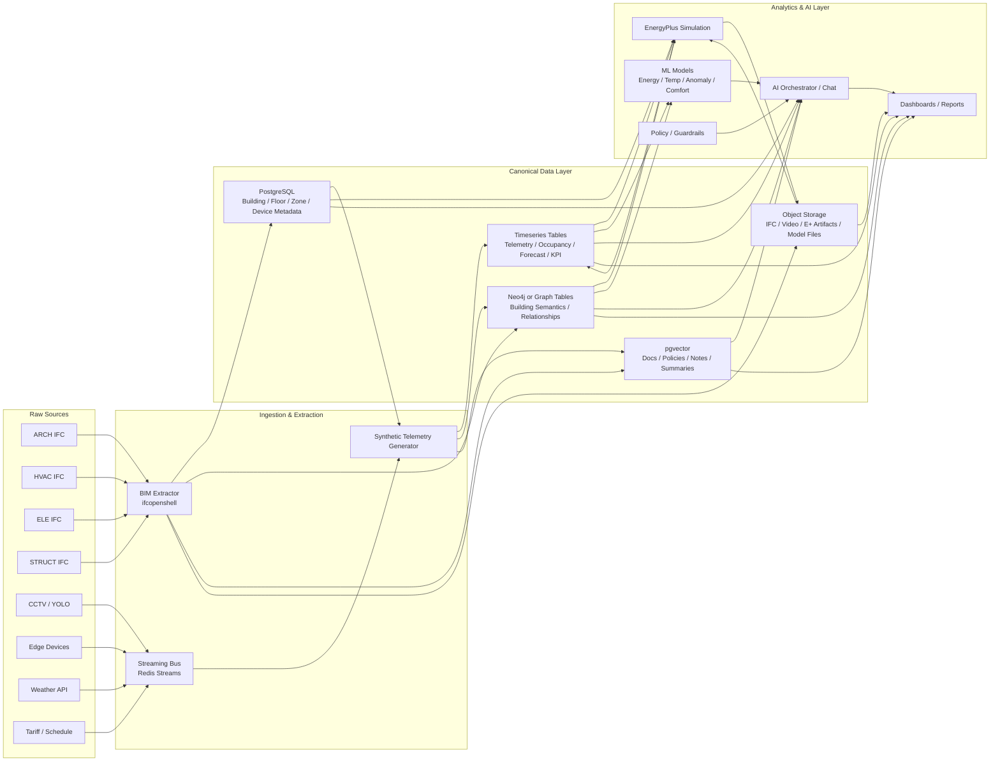

# GreenFlow Database Architecture

Sơ đồ này mô tả cách GreenFlow lưu dữ liệu BIM, telemetry, graph semantics, vector retrieval và artifacts mô phỏng để AI chat có thể hiểu ngữ cảnh tòa nhà và truy vấn metrics.

## Quy ước lưu trữ

- Raw IFC giữ nguyên trong `Dataset/BIM`.
- Canonical extraction lưu thành JSON/CSV/Parquet để app và agent dùng trực tiếp.
- Time-series lớn nên lưu Parquet hoặc bảng partitioned trong PostgreSQL / TimescaleDB.
- Quan hệ tòa nhà và truy vấn nhiều bước nên để trong Neo4j hoặc graph tables.
- Text ngữ nghĩa, policy, transcript, simulation summary nên embed vào `pgvector`.
- File nặng như IFC, video, EnergyPlus output, model artifacts nên để object storage.

## Mục tiêu cho AI chat

AI chat không hỏi trực tiếp một file BIM thô. Nó đi qua 4 lớp:

1. `PostgreSQL` lấy metrics hiện tại.
2. `Neo4j` lấy ngữ cảnh quan hệ tòa nhà.
3. `pgvector` lấy policy, notes, transcript, simulation summary.
4. `EnergyPlus` hoặc ML models lấy dự báo / what-if / validation.

Nhờ vậy chat có thể trả lời các câu như:

- zone nào đang tiêu thụ điện cao nhất;
- thiết bị nào phục vụ zone này;
- action nào an toàn để giảm load;
- tại sao simulation pass hoặc fail;
- metric nào đang vượt ngưỡng.
